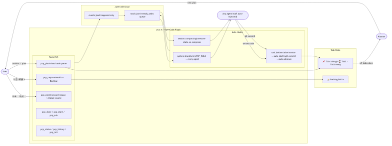

# PCP Skills for OpenCode

**PCP (Progress Control Plane)** — Task queue and backlog management for AI coding agents.

Solves two problems:
1. **Lost main thread** — agent wanders off mid-task, forgets what it was doing
2. **Scope creep** — user adds "oh also do X" mid-sprint, derailing current work

## Architecture



## Install

```bash
npx skills add JohnnyHua/pcp-skills
```

Then load the `pcp-setup` skill in OpenCode to complete installation:

> In OpenCode chat: *"Load skill pcp-setup and run it"*

## Compatibility

| Tool | Status | Notes |
|------|--------|-------|
| **OpenCode** | ✅ Full support | Plugin + auto hooks + context injection |
| Claude Code | 🔜 Planned | Skills work manually; auto-hooks need adapter |
| Cursor / Cline / others | 🔜 Planned | Skills work manually; plugin needs porting |

> The core concepts (task queue, backlog, pivot) are tool-agnostic. The `pcp.ts` plugin currently uses the OpenCode plugin SDK. Adapters for other tools are welcome via PR.

## What You Get

| Component | Type | Purpose |
|-----------|------|---------|
| `pcp.ts` | Plugin | 12 tools + auto-lifecycle hooks + universal context injection |
| `pcp-intake` | Skill | Onboard an existing project into PCP (5-step guided flow) |
| `pcp-sprint-review` | Skill | End-of-sprint backlog review (one-question-at-a-time) |
| `pcp-setup` | Skill | Install all PCP components in 30 seconds |

> **No dedicated agent needed.** PCP rules are automatically injected into ALL agents via `system.transform` hook.

## How It Works

### Plan → Execute → Plan cycle
```
User provides todolist/plan
  → Agent parses and calls pcp_plan(tasks)
  → T001 = doing, T002..T005 = queued
  → Work on T001, git commit → auto-advance to T002
  → ...
  → All tasks done → PCP prompts: "Let planner create next plan"
```

### Mid-sprint captures
```
User: "also add OAuth later"
Agent: calls pcp_capture("Add OAuth") → "Captured to backlog [B001], continuing sprint."
```

### Mid-task pivot
```
User: "actually, let's generate the news draft directly instead"
Agent: detects pivot signal → confirms → pcp_pivot("more efficient approach", new_task="Generate news draft")
  → T002 marked as pivoted (with reason), T003 starts immediately
```

### Backlog review
```
Agent: "[B001] Add OAuth — include in next sprint? A) Yes  B) Later  C) Dismiss"
User:  "A"
Agent: pcp_promote("B001") → added as subtask T006
```

## Tools Reference

| Tool | Description |
|------|-------------|
| `pcp_init` | Scan project, establish baseline context (run once) |
| `pcp_plan` | Load a task list — first = doing, rest = queued |
| `pcp_start` | Start a sprint manually with custom title |
| `pcp_sub` | Push a subtask onto the stack |
| `pcp_done` | Close current task (auto-advances to next in queue) |
| `pcp_pivot` | Abandon current task with reason, start new direction |
| `pcp_status` | Show current task, queue, and backlog |
| `pcp_capture` | Add item to backlog (do not execute now) |
| `pcp_backlog` | List all pending backlog items |
| `pcp_promote` | Promote backlog item to current sprint subtask |
| `pcp_dismiss` | Permanently dismiss a backlog item |
| `pcp_history` | Full history: all sprints + queue + backlog |

## Requirements

- [OpenCode](https://opencode.ai) v1.2+
- macOS or Linux (Windows: manual install)
- Bun or Node.js (for plugin compilation)

## Data

PCP stores all data locally in `{project-dir}/.opencode/pcp/`:
- `events.jsonl` — append-only event log (full history)
- `stack.json` — current state cache (includes ready_tasks queue)

No data leaves your machine.

## License

MIT
