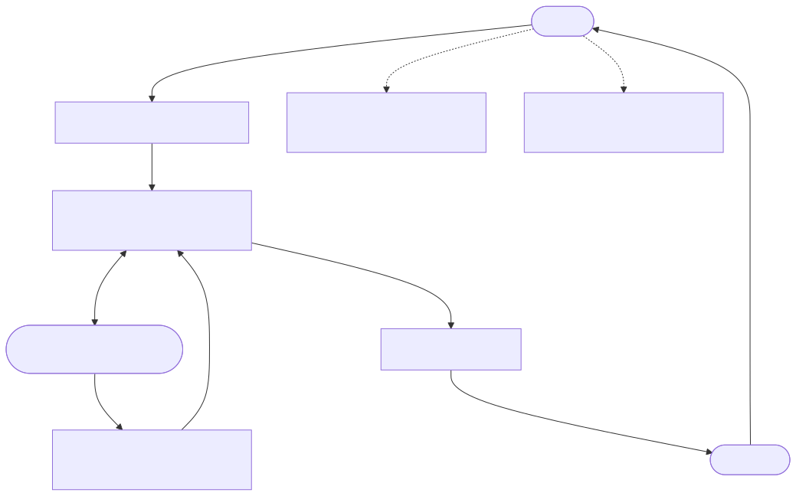

# PCP Skills for OpenCode

> A workflow control layer for AI coding agents. Keep the main task on track, collect side requests safely, and hand work off across tools without losing context.

**PCP (Progress Control Plane)** is a workflow layer for AI coding agents. It helps an AI stay on the current task, collect side requests without losing focus, and hand work off cleanly when you switch tools.

For a normal user, the idea is simple:
1. You tell the agent what to do.
2. PCP turns that into a visible task flow.
3. The agent works through it without quietly changing the plan.
4. If you switch to another tool, PCP writes a handoff so the next agent can continue.

It mainly solves these problems:
1. **Lost main thread** — the agent wanders off and forgets the real task
2. **Scope creep** — "also do X" interrupts the current sprint
3. **Context loss between tools** — switching from one AI tool to another means re-explaining everything

## Project Outline

PCP is not another coding agent. It is a control layer that sits above AI coding agents and keeps software development on a visible, reviewable workflow.

At a high level, the project has five parts:
1. **Plan and Task flow** — turn approved work into formal tasks and a queue
2. **Execution control** — keep the current task on track and stop silent task skipping
3. **Proposal and approval** — let agents suggest work without silently creating formal tasks
4. **Context continuity** — use handoff and intake to continue work across AI tools
5. **Project memory** — keep backlog, concern log, worklog, and changelog as persistent process records

The current implementation already includes:
- persisted `TaskCard`, `Plan`, `Blueprint`, and `Proposal` objects
- gated task completion with explicit approval
- approved-only task and subtask creation
- machine-readable handoff and intake
- concern logging for future-stage architecture questions

The long-term goal is to make AI development feel structured instead of improvised: the agent should know what it is doing, why it is doing it, what still needs approval, and how to hand work to the next tool without losing context.

## Architecture



## Quickstart

If PCP is already installed and you only want the shortest day-to-day flow, start here:

- [PCP Quickstart](docs/quickstart.md)

## Install

```bash
npx skills add JohnnyHua/pcp-skills
```

Then load the `pcp-setup` skill in OpenCode to complete installation:

> In OpenCode chat: *"Load skill pcp-setup and run it"*

## Compatibility

| Tool | Status | Notes |
|------|--------|-------|
| **OpenCode** | ✅ Full support | Plugin + auto hooks + context injection |
| Claude Code | 🔜 Planned | Skills work manually; auto-hooks need adapter |
| Cursor / Cline / others | 🔜 Planned | Skills work manually; plugin needs porting |

> The core concepts (task queue, backlog, pivot) are tool-agnostic. The `pcp.ts` plugin currently uses the OpenCode plugin SDK. Adapters for other tools are welcome via PR.

## What You Get

| Component | Type | Purpose |
|-----------|------|---------|
| `pcp.ts` | Plugin | 13 tools + auto-lifecycle hooks + universal context injection |
| `pcp-intake` | Skill | Onboard an existing project into PCP (5-step guided flow) |
| `pcp-sprint-review` | Skill | End-of-sprint backlog review (one-question-at-a-time) |
| `pcp-setup` | Skill | Install all PCP components in 30 seconds |

> **No dedicated agent needed.** PCP rules are automatically injected into ALL agents via `system.transform` hook.

## How It Works

### Plan → Execute → Plan cycle
```
User provides todolist/plan
  → Agent parses and calls pcp_plan(tasks)
  → approved tasks become formal TaskCards + queue
  → T001 = doing, T002..T005 = queued
  → Work on T001
  → pcp_done submits completion for approval
  → user decides whether to pcp_approve and continue
  → current round ends, then planner creates the next plan
```

### Mid-sprint captures
```
User: "also add OAuth later"
Agent: calls pcp_capture("Add OAuth") → "Captured to backlog [B001], continuing sprint."
```

### Mid-task pivot
```
User: "actually, let's generate the news draft directly instead"
Agent: detects pivot signal → confirms → pcp_pivot("more efficient approach", new_task="Generate news draft")
  → T002 marked as pivoted (with reason), T003 starts immediately
```

### Backlog review
```
Agent: "[B001] Add OAuth — include in next sprint? A) Yes  B) Later  C) Dismiss"
User:  "A"
Agent: pcp_promote("B001") → added as subtask T006
```

### Cross-tool handoff
```
User: "Generate a handoff for Claude Code"
Agent: calls pcp_handoff(audience="Claude Code", focus="continue current task")
  → writes .opencode/pcp/HANDOFF.md with current task, progress, backlog, recent events, and next steps
```

## Tools Reference

| Tool | Description |
|------|-------------|
| `pcp_init` | Scan project, establish baseline context (run once) |
| `pcp_plan` | Compile an approved task list into formal TaskCards and queue state |
| `pcp_start` | Start a sprint manually with custom title |
| `pcp_sub` | Propose a temporary subtask; it still requires approval before becoming a real stacked subtask |
| `pcp_done` | Submit the current task as completed; in `gated` mode it waits for approval before advancing |
| `pcp_approve` | Approve a pending completion and advance the task flow |
| `pcp_set_completion_mode` | Switch between `gated` and `auto` completion behavior |
| `pcp_pivot` | Abandon current task with reason, start new direction |
| `pcp_status` | Show current task, queue, backlog, pending approvals, and Blueprint hint/state |
| `pcp_handoff` | Generate `.opencode/pcp/HANDOFF.md` and `HANDOFF.json` for another AI tool or operator |
| `pcp_intake` | Resume a machine-readable handoff snapshot in a PCP-aware environment |
| `pcp_blueprint_create` | Create a Blueprint for the current complex doing task |
| `pcp_blueprint_show` | Show the active Blueprint or list recent Blueprints |
| `pcp_blueprint_propose_subtask` | Turn a chosen Blueprint step into an approval-gated subtask proposal |
| `pcp_propose_task` | Record a proposed follow-up task without turning it into a formal T-task |
| `pcp_list_task_proposals` | Review pending and historical task/subtask proposals |
| `pcp_approve_task_proposal` | Turn an approved proposal into a formal queued task or stacked subtask |
| `pcp_reject_task_proposal` | Reject a proposal without affecting the formal queue |
| `pcp_capture` | Add item to backlog (do not execute now) |
| `pcp_backlog` | List all pending backlog items |
| `pcp_promote` | Promote backlog item to current sprint subtask |
| `pcp_dismiss` | Permanently dismiss a backlog item |
| `pcp_history` | Full history: all sprints + queue + backlog |
| `pcp_concern_capture` | Record a future-stage concern that should be revisited later |
| `pcp_concern_list` | List saved concerns |
| `pcp_concern_match` | Match concerns by tags for a specific host/phase/artifact |

## Requirements

- [OpenCode](https://opencode.ai) v1.2+
- macOS or Linux (Windows: manual install)
- Bun or Node.js (for plugin compilation)

## Local Development

```bash
npm install
npm run typecheck
npm test
npm run check
```

`npm run check` runs the minimal local gate: TypeScript type-checking plus the handoff smoke test.

## Data

PCP stores all data locally in `{project-dir}/.opencode/pcp/`:
- `events.jsonl` — append-only event log (full history)
- `stack.json` — current state cache (includes ready_tasks queue)
- `WORKLOG.md` — chronological work notes used by `pcp_handoff`
- `PROJECT.md` / `PROJECT.json` — project baseline and status snapshot
- `HANDOFF.md` — on-demand cross-tool context handoff generated by `pcp_handoff`

No data leaves your machine.

## License

MIT
