# PCP Skills for OpenCode

**PCP (Progress Control Plane)** — 面向 AI 编程助手的任务队列与 Backlog 管理系统。

解决两个核心问题：
1. **主线丢失** — Agent 执行到一半跑偏，忘记在做什么
2. **需求蔓延** — 用户中途插入"顺便做 X"，打断当前开发节奏

## 架构图



## 安装

```bash
npx skills add JohnnyHua/pcp-skills
```

安装后，在 OpenCode 聊天框加载 `pcp-setup` skill 完成初始化：

> 在 OpenCode 聊天框输入：*"Load skill pcp-setup and run it"*

## 兼容性

| 工具 | 状态 | 备注 |
|------|------|------|
| **OpenCode** | ✅ 完整支持 | Plugin + 自动 hooks + 上下文注入 |
| Claude Code | 🔜 计划中 | Skill 可手动使用；自动 hooks 需适配 |
| Cursor / Cline / 其他 | 🔜 计划中 | Skill 可手动使用；Plugin 需移植 |

> 核心概念（任务队列、Backlog、Pivot）与工具无关。`pcp.ts` 插件目前基于 OpenCode Plugin SDK 实现，欢迎通过 PR 贡献其他工具的适配器。

## 组件一览

| 组件 | 类型 | 用途 |
|------|------|------|
| `pcp.ts` | Plugin | 12 个工具 + 自动生命周期 hooks + 全局上下文注入 |
| `pcp-intake` | Skill | 将已有项目接入 PCP（5 步引导流程） |
| `pcp-sprint-review` | Skill | Sprint 结束后逐条 review Backlog |
| `pcp-setup` | Skill | 30 秒完成全部 PCP 组件安装 |

> **无需专属 Agent。** PCP 规则通过 `system.transform` hook 自动注入到所有 Agent。

## 工作原理

### Plan → Execute → Plan 循环
```
用户提供 todolist / 计划
  → Agent 解析并调用 pcp_plan(tasks)
  → T001 = doing，T002..T005 = 队列待执行
  → 完成 T001，git commit → 自动推进到 T002
  → ...
  → 所有任务完成 → PCP 提示："请 Planner 规划下一轮"
```

### 开发中途捕获需求
```
用户："顺便把 OAuth 也加了"
Agent：调用 pcp_capture("Add OAuth") → "已存入 Backlog [B001]，继续当前任务。"
```

### 中途转向（Pivot）
```
用户："本来想手动写，发现直接生成更高效"
Agent：检测到转向信号 → 确认 → pcp_pivot("更高效的方案", new_task="直接生成草稿")
  → T002 标记为 pivoted（附原因），立即开始 T003
```

### Backlog Review
```
Agent："[B001] Add OAuth — 加入下一个 Sprint？A) 是  B) 以后  C) 忽略"
用户：输入 "A"
Agent：pcp_promote("B001") → 加入当前 Sprint 作为子任务 T006
```

## 工具参考

| 工具 | 说明 |
|------|------|
| `pcp_init` | 扫描项目，建立基础上下文（只需运行一次） |
| `pcp_plan` | 加载任务列表 — 第一个 = doing，其余 = 队列 |
| `pcp_start` | 手动开启一个 Sprint，指定标题 |
| `pcp_sub` | 压入子任务（执行完自动返回父任务） |
| `pcp_done` | 完成当前任务（自动推进队列中下一个） |
| `pcp_pivot` | 放弃当前任务并记录原因，转向新方向 |
| `pcp_status` | 查看当前任务、队列和 Backlog |
| `pcp_capture` | 将需求存入 Backlog（当前不执行） |
| `pcp_backlog` | 列出所有待处理的 Backlog 条目 |
| `pcp_promote` | 将 Backlog 条目提升为当前 Sprint 子任务 |
| `pcp_dismiss` | 永久忽略一条 Backlog 条目 |
| `pcp_history` | 完整历史：所有 Sprint + 队列 + Backlog |

## 环境要求

- [OpenCode](https://opencode.ai) v1.2+
- macOS 或 Linux（Windows 需手动安装）
- Bun 或 Node.js（用于编译插件）

## 数据存储

PCP 所有数据本地存储在 `{项目目录}/.opencode/pcp/`：
- `events.jsonl` — 追加写入的事件日志（完整历史）
- `stack.json` — 当前状态缓存（含 ready_tasks 队列）

数据不会离开你的机器。

## 开源协议

MIT
